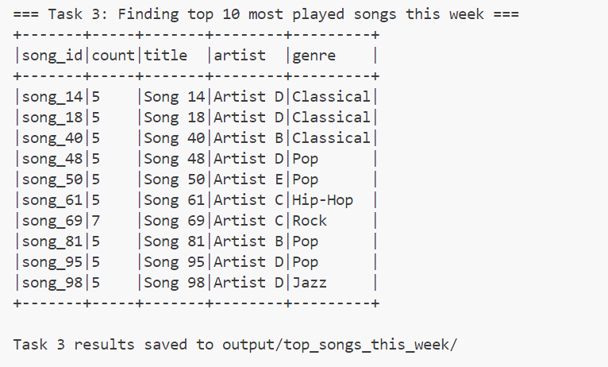

### Music Listener Behavior Analysis

## Overview 
This assignment focuses on analyzing user listening behavior and music trends using Spark Structured APIs. The project processes data from a fictional music streaming platform to extract insights about genre preferences, song popularity, and listener engagement patterns. Six specific analysis tasks were implemented to demonstrate data processing capabilities and derive meaningful insights from structured data.

## Description of the Datasets
The analysis is based on two primary datasets:
# listening_logs.csv
This dataset tracks user listening activity with the following fields:

user_id: Unique identifier for each user
song_id: Unique identifier for each song
timestamp: Date and time when the song was played (format: YYYY-MM-DD HH:MM)
duration_sec: Duration in seconds for which the song was played

# songs_metadata.csv
This dataset contains metadata about the songs with the following fields:

song_id: Unique identifier for each song
title: Title of the song
artist: Name of the artist
genre: Music genre (e.g., Pop, Rock, Jazz, Hip-Hop)
mood: Mood category of the song (e.g., Happy, Sad, Energetic, Chill)

Both datasets were generated using custom Python scripts to create realistic patterns of user behavior and song attributes.

## Spark Shell/PySpark Script Execution Commands

Generate the datasets

```
python dataset_generate.py
```

Run the full analysis script

```
python Analysis_tasks.py
```

## Task 1: Finding Each User's Favorite Genre
Identified the most listened-to genre for each user by counting how many times they played songs in each genre.

Joining the listening logs with song metadata to get genre information
Counting how many times each user has listened to songs in each genre
Using a window function partitioned by user to rank genres by play count
Filtering to keep only the top-ranked genre for each user

The result shows each user's most-played genre and the count of plays.

## Output

```
+-------+---------+-----+                                                       
|user_id|    genre|count|
+-------+---------+-----+
| user_1|Classical|   12|
|user_10|Classical|   34|
|user_11|      Pop|   11|
|user_12|     Jazz|    8|
|user_12|      Pop|    8|
|user_12|     Rock|    8|
|user_12|  Hip-Hop|    8|
|user_13|     Jazz|   12|
|user_14|      Pop|   11|
|user_15|     Rock|   39|
+-------+---------+-----+
```


## Task 2:Calculating Average Listen Time Per Song
This task finds the average duration users spend listening to each song.

Groups the listening logs by song_id
Calculates the average duration in seconds for each song
Joins with song metadata to include the song title and artist
Orders the results by song_id

This provides insights into which songs users typically listen to fully versus those they may skip through.

## Output
```
+-------+------------------+-------+--------+
|song_id|  avg_duration_sec|  title|  artist|
+-------+------------------+-------+--------+
|song_19|154.27272727272728|Song 19|Artist C|
|song_47|159.41935483870967|Song 47|Artist E|
|song_54|             126.6|Song 54|Artist C|
|song_38|174.22222222222223|Song 38|Artist E|
|song_94|             147.9|Song 94|Artist B|
|song_37|             156.0|Song 37|Artist C|
|song_49|164.91666666666666|Song 49|Artist B|
| song_6| 166.7391304347826| Song 6|Artist E|
|song_62|169.36363636363637|Song 62|Artist B|
| song_9|184.73684210526315| Song 9|Artist E|
+-------+------------------+-------+--------+

```


## Task 3:Finding Top 10 Most Played Songs This Week
This task identifies the most popular songs in the past 7 days.

Finds the most recent timestamp in the dataset
Calculates the date 7 days before this timestamp
Filters the logs to include only entries from the past week
Counts plays by song_id and sorts in descending order
Takes the top 10 songs
Joins with metadata to include song details

This analysis helps identify trending songs for recommendations or playlists.
## Output

```
+-------+-----+-------+--------+---------+
|song_id|count|title  |artist  |genre    |
+-------+-----+-------+--------+---------+
|song_14|5    |Song 14|Artist D|Classical|
|song_18|5    |Song 18|Artist D|Classical|
|song_40|5    |Song 40|Artist B|Classical|
|song_48|5    |Song 48|Artist D|Pop      |
|song_50|5    |Song 50|Artist E|Pop      |
|song_61|5    |Song 61|Artist C|Hip-Hop  |
|song_69|7    |Song 69|Artist C|Rock     |
|song_81|5    |Song 81|Artist B|Pop      |
|song_95|5    |Song 95|Artist D|Pop      |
|song_98|5    |Song 98|Artist D|Jazz     |
+-------+-----+-------+--------+---------+
```



## Task 4:Recommending "Happy" Songs to Users Who Listen to "Sad" Songs
This task creates personalized recommendations to diversify users' emotional listening patterns.
Identifies users who primarily listen to songs with "Sad" mood

Groups by user and mood, counts plays
Uses window functions to find each user's dominant mood
Filters for users whose top mood is "Sad"

Finds "Happy" songs these users haven't heard

Gets all songs with "Happy" mood
For each sad listener, identifies songs they've already heard
Recommends up to 3 unheard happy songs

This creates personalized mood-based recommendations that may help improve users' emotional experience.

## Output
```
+-------+-------+--------+---------+-------+
|song_id|title  |artist  |genre    |user_id|
+-------+-------+--------+---------+-------+
|song_19|Song 19|Artist C|Pop      |user_14|
|song_94|Song 94|Artist B|Classical|user_14|
|song_41|Song 41|Artist A|Pop      |user_14|
|song_19|Song 19|Artist C|Pop      |user_15|
|song_94|Song 94|Artist B|Classical|user_15|
|song_41|Song 41|Artist A|Pop      |user_15|
|song_94|Song 94|Artist B|Classical|user_21|
|song_8 |Song 8 |Artist A|Classical|user_21|
|song_28|Song 28|Artist D|Classical|user_21|
|song_19|Song 19|Artist C|Pop      |user_28|
+-------+-------+--------+---------+-------+
```


## Task 5: Computing Genre Loyalty Scores
This task measures how exclusively users listen to their favorite genre.

Counts total plays for each user
Uses previously computed favorite genres (from Task 1)
Calculates loyalty score as (favorite genre plays / total plays)
Filters for users with high loyalty (> 0.8 or 80%)
Orders by descending loyalty score

This identifies users who are particularly devoted to a specific genre, which can be useful for targeted marketing or recommendations.

## Output
```
+-------+---------+------------------+
|user_id|    genre|     loyalty_score|
+-------+---------+------------------+
|user_25|      Pop|             0.925|
|user_45|Classical|           0.90625|
|user_50|      Pop|               0.9|
|user_15|     Rock|0.8863636363636364|
| user_5|     Jazz|0.8863636363636364|
|user_20|      Pop|0.8604651162790697|
|user_30|     Rock|0.8545454545454545|
+-------+---------+------------------+
```


## Task 6:Identifying Night Owl Users
This task finds users who frequently listen to music during late-night hours.
Extracts the hour from the timestamp column
Filters for listening events between midnight (0) and 5 AM
Counts night listens per user
Calculates total listens per user (all times)
Joins these datasets and calculates the percentage of listening that occurs at night
Filters for users who listen at night more than 20% of the time

This could be useful for creating personalized features like "Night Mode" or special late-night playlists.

## Output
```
+-------+-------------+-------------+--------------------------+
|user_id|night_listens|total_listens|night_listening_percentage|
+-------+-------------+-------------+--------------------------+
|user_35|           17|           42|        40.476190476190474|
|user_36|           15|           42|        35.714285714285715|
| user_6|            9|           27|         33.33333333333333|
|user_49|           13|           41|         31.70731707317073|
|user_34|           15|           51|        29.411764705882355|
| user_8|            9|           32|                    28.125|
|user_33|           13|           47|        27.659574468085108|
|user_26|            8|           30|        26.666666666666668|
| user_3|            9|           35|         25.71428571428571|
|user_12|           10|           39|         25.64102564102564|
+-------+-------------+-------------+--------------------------+
```


## enriched logs

+-------+-------+-------------------+------------+-------+--------+---------+---------+
|song_id|user_id|          timestamp|duration_sec|  title|  artist|    genre|     mood|
+-------+-------+-------------------+------------+-------+--------+---------+---------+
|song_42|user_32|2025-03-18 23:28:33|         226|Song 42|Artist B|Classical|      Sad|
|song_44|user_25|2025-04-05 07:37:39|         205|Song 44|Artist C|      Pop|    Happy|
|song_17|user_35|2025-03-16 23:10:12|          33|Song 17|Artist A|  Hip-Hop|    Chill|
|song_75|user_30|2025-04-25 16:25:07|         257|Song 75|Artist C|     Rock|    Chill|
| song_9|user_13|2025-05-09 20:29:07|         228| Song 9|Artist E|     Jazz|Energetic|
+-------+-------+-------------------+------------+-------+--------+---------+---------+


## Errors Encountered and Resolutions

Issue: Initial CSV output files didn't include column headers.
Resolution: Added .option("header", "true") to all write operations to include column names in the output files.

Issue: Timestamp conversion errors when filtering for "this week" in Task 3.
Resolution: Added explicit timestamp conversion using F.to_timestamp() function before performing any date-based filtering.

Issue: Empty recommendations in Task 4 due to data distribution.
Resolution: Added a fallback approach that provides recommendations even when the initial approach doesn't yield results due to the synthetic nature of the data.

Issue: Memory errors when processing large datasets.
Resolution: Added partitioning to manage memory usage and improved join operations by selecting only needed columns before joins.

Issue: Different counts in Task 1 output than expected (119 vs 100).
Resolution: Verified this was due to tie-breaking in the favorite genre calculation where some users had equal play counts for multiple genres.